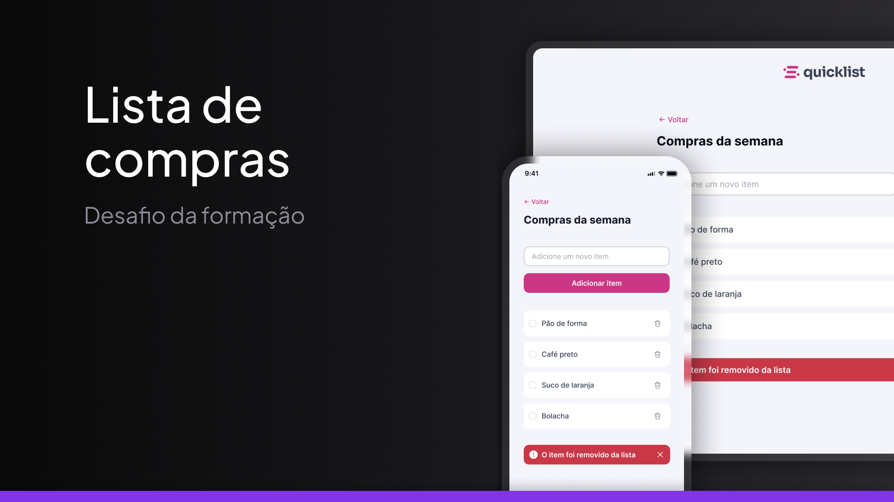

<h1 align="center"> Desafio - Quicklist </h1>

Uma página para criação de listas feita como forma de um desafio do curso Fullstack da Rocketseat

<a href="https://guilhermedkdk.github.io/js-quicklist/">🔗 Live Preview</a>&nbsp;&nbsp;&nbsp;|&nbsp;&nbsp;&nbsp;
<a href="#-tecnologias">🚀 Tecnologias</a>&nbsp;&nbsp;&nbsp; |&nbsp;&nbsp;&nbsp;&nbsp;
<a href="#-desafio">💻 Desafio</a>&nbsp;&nbsp;&nbsp;|&nbsp;&nbsp;&nbsp;
<a href="#-aprendizados">📚 Aprendizados</a>

## 🚀 Tecnologias

Esse projeto foi desenvolvido com as seguintes tecnologias:

- JavaScript
- Git e Github
- FIGMA

## 💻 Desafio

A "Quicklist" foi um desafio do curso Fullstack da Rocketseat no módulo "JavaScript". Nele, apliquei conceitos de variáveis, manipulação do DOM e eventos para criar uma funcionalidade de reembolso, consolidando os conhecimentos adquiridos no módulo.

## 📚 Aprendizados

Este projeto foi feito como forma de um desafio dentro do curso de Fullstack no módulo "JavaScript" da Rocketseat.
Nele pude consolidar os conhecimentos sobre:

### JavaScript
- Variáveis
- DOM
- Eventos
